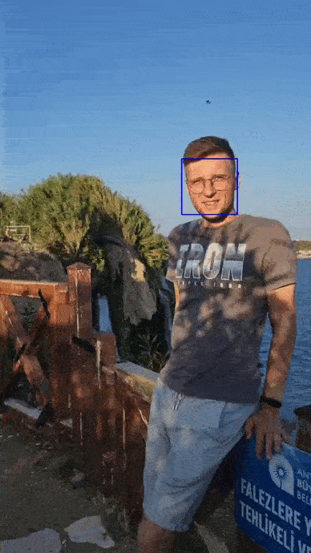

# Computer vision: Face Detection in Video Stream

## Описание
Этот репозиторий содержит Python-скрипт для обнаружения лиц в видеопотоках в реальном времени. OpenCV анализирует каждый кадр видео и обнаруживает лица с помощью алгоритма Haar Cascade и отображает результаты, рисуя прямоугольник вокруг обнаруженных лиц.
Это простое, но эффективное решение для приложений, связанных с видеонаблюдением, интерактивными медиа, безопасностью и образовательными проектами.

## Особенности
- **Обнаружение лиц в реальном времени**: Анализирует видеопотоки и обнаруживает лица в каждом кадре в режиме реального времени.
- **Настройка параметров обнаружения**: Возможность настройки параметров для улучшения точности и уменьшения ложных срабатываний.
- **Поддержка различных видеоформатов**: Скрипт может обрабатывать видео в различных форматах, поддерживаемых библиотекой OpenCV.
- **Гибкий и расширяемый**: Код легко модифицируется и может быть адаптирован под различные требования и условия использования.

## Технологии
- **Python**: Скрипт написан на Python, что делает его легко читаемым и поддерживаемым.
- **OpenCV**: Используется для обработки видео и обнаружения лиц.

## Установка и использование
1. Клонируйте репозиторий:
```bash
git clone https://github.com/TheRomanVolkov/FaceDetectionVideoTool.git
```

2. Установите необходимые зависимости: 
```bash
pip install -r requirements.txt
```


3. Запустите скрипт и передайте путь к вашему видеофайлу.


